<div align="center">

# 🎓 CLSU-ERDT Scholar Management System

[](https://laravel.com)
[](https://livewire.laravel.com)
[](https://tailwindcss.com)
[](https://mysql.com)
[](https://redis.io)

**A comprehensive web application for managing scholarship programs, academic progress tracking, and research manuscript submissions**

[🚀 Quick Start](#-quick-setup) • [📖 Documentation](#-core-features) • [🛠️ Installation](#-installation--setup) • [🧪 Testing](#-testing) • [🤝 Contributing](#-contributing)

</div>

---

## 🌟 Overview

The **CLSU-ERDT** (Central Luzon State University - Engineering Research and Development for Technology) Scholar Management System is a modern, full-featured web application built with Laravel that streamlines scholarship administration. From scholar onboarding to fund disbursement and research tracking, this system provides a complete solution for academic institutions managing scholarship programs.

### ✨ Why Choose CLSU-ERDT?

- 🔐 **Secure & Compliant** - Enterprise-grade security with comprehensive audit trails
- 📱 **Modern Interface** - Responsive design with real-time updates using Livewire
- 🚀 **High Performance** - Redis caching and optimized database queries
- 📊 **Rich Analytics** - Comprehensive reporting and dashboard insights
- 🔧 **Highly Configurable** - Flexible request types and workflow customization
- 🌐 **Multi-Role Support** - Tailored experiences for admins, scholars, and super admins

## System Architecture

### Technology Stack
- **Backend Framework**: Laravel 12.x with MVC architecture
- **Frontend**: Blade templates with Livewire 3.6+ for dynamic components
- **Database**: MySQL 8.0+ with comprehensive audit logging
- **Authentication**: Laravel Fortify with JWT support
- **Caching**: Redis with Predis client for session and cache management
- **CSS Framework**: Tailwind CSS 3.2+ with custom components
- **Build Tool**: Vite 6.x for modern asset bundling and hot reloading
- **Node.js**: Version 18+ (LTS recommended)
- **PDF Generation**: DomPDF for report generation
- **Excel Export**: PhpSpreadsheet for data exports

## 🚀 Core Features

<table>
<tr>
<td width="50%">

### 🔐 Multi-Role Authentication System

**👥 Roles:**
- **Admins**: Full system management, scholar oversight, fund approval
- **Scholars**: Document submission, fund requests, manuscript management
- **Super Admins**: System configuration, user management, analytics

**🔒 Authentication Features:**
- Email-based authentication with secure password policies
- JWT token support for API authentication
- Role-based access control with granular permissions
- Session management with Redis backend
- Password reset functionality with secure tokens
- Activity logging for all authentication events

### 👤 Scholar Profile Management

Comprehensive scholar profiles including:
- **📋 Personal Information**: Name, contact details, address, student ID
- **🎓 Academic Details**: University, department, program, enrollment status
- **📊 Scholarship Status**: New, Ongoing, On Extension, Graduated, Terminated
- **📁 Document Portfolio**: Academic records, certificates, supporting documents
- **📈 Performance Tracking**: Fund utilization, academic progress, milestone completion
- **⏰ Timeline Management**: Application progress, status changes, important dates

### 💰 Fund Request System

**📝 Request Types:**
- Configurable request types with specific requirements
- Amount limits and approval workflows
- Document attachment requirements

**🔄 Workflow:**
- Draft → Submitted → Under Review → Approved/Rejected → Disbursed
- Real-time status updates and notifications
- Admin review with comments and feedback
- Disbursement tracking and financial reporting
- Budget allocation monitoring

**✨ Features:**
- Multi-document upload support
- File validation and security scanning
- Status history tracking
- Automated notifications
- Bulk operations for admins

### 📁 Document Management System

**📄 Document Types:**
- Personal identification documents
- Academic transcripts and certificates
- Fund request supporting documents
- Manuscript submissions
- Research outputs

**🛡️ Features:**
- Secure file upload with virus scanning
- Document verification workflow
- Version control and history tracking
- Encrypted storage with access controls
- Batch download capabilities
- Document status tracking (Pending, Verified, Rejected)

</td>
<td width="50%">

### 📚 Manuscript Management

**🔬 Academic Research Features:**
- Manuscript submission and tracking
- Version control for document revisions
- Peer review workflow with comments
- Status progression: Draft → Submitted → Under Review → Approved/Rejected
- Export capabilities for various formats
- Batch operations for administrators

### 📊 Advanced Analytics & Reporting

**📈 Dashboard Analytics:**
- Real-time scholar statistics
- Fund request metrics and trends
- Document verification status
- Performance indicators and KPIs

**📋 Report Generation:**
- Scholar status distribution reports
- Fund utilization analysis
- Document verification reports
- Custom date range filtering
- Export to PDF, Excel, and CSV formats
- Scheduled report generation

### 🔍 Comprehensive Audit System

**📝 Audit Logging:**
- All user actions tracked with timestamps
- CRUD operations on critical entities
- Fund approval/rejection events
- Document verification activities
- Profile changes with detailed diffs
- System security events

**✅ Compliance Features:**
- Immutable audit trail
- User activity reports
- Data integrity verification
- Export capabilities for compliance reporting

</td>
</tr>
</table>

## Database Schema

### Core Models

1. **User**: Authentication and basic user information
2. **ScholarProfile**: Extended scholar information and academic details
3. **FundRequest**: Fund request records with complete workflow tracking
4. **RequestType**: Configurable fund request types and requirements
5. **Document**: Document management with metadata and file references
6. **Disbursement**: Fund disbursement records and tracking
7. **Manuscript**: Academic manuscript submissions and reviews
8. **ReviewComment**: Comments and feedback on manuscripts
9. **AuditLog**: Comprehensive system activity logging
10. **CustomNotification**: User notification system
11. **Announcement**: System-wide announcements
12. **ApplicationTimeline**: Scholarship application process tracking
13. **ImportantNote**: Administrative notes and reminders

15. **HistoryAchievement**: Achievement tracking
16. **HistoryContentBlock**: Content management for history pages
17. **SiteSetting**: System configuration and settings
18. **FacultyMember**: Faculty and staff information

### Key Relationships
- One-to-one: User ↔ ScholarProfile
- One-to-many: ScholarProfile → FundRequest, Document, Manuscript
- One-to-many: FundRequest → Disbursement
- Polymorphic: Comments, Attachments, Audit Logs

## Application Workflow

### Scholar Journey
1. **Registration & Profile Setup**: Complete academic and personal information
2. **Document Upload**: Submit required verification documents
3. **Fund Request Submission**: Create requests with supporting documentation
4. **Status Tracking**: Monitor request progress with real-time updates
5. **Manuscript Management**: Submit and track research outputs
6. **Performance Dashboard**: Access analytics and progress reports

### Administrator Workflow
1. **Scholar Management**: Review and approve scholar profiles
2. **Fund Request Processing**: Evaluate, approve, or reject funding requests
3. **Document Verification**: Review and verify submitted documents
4. **Disbursement Management**: Process approved fund disbursements
5. **Manuscript Review**: Provide feedback on research submissions
6. **Analytics & Reporting**: Generate comprehensive system reports

## Security & Compliance

### Security Features
- **Input Validation**: Comprehensive form validation with custom rules
- **File Upload Security**: Virus scanning, type validation, size limits
- **CSRF Protection**: All forms protected with Laravel's CSRF tokens
- **SQL Injection Prevention**: Eloquent ORM with prepared statements
- **XSS Protection**: Output escaping and Content Security Policy
- **Rate Limiting**: API endpoints protected against abuse
- **Audit Logging**: Complete action tracking for compliance

### Data Protection
- **Encryption**: Sensitive data encrypted at rest and in transit
- **Access Control**: Role-based permissions with granular controls
- **Session Security**: Secure session handling with Redis
- **Password Security**: Bcrypt hashing with configurable complexity
- **File Storage**: Secure file storage with access controls

## 🛠️ Installation & Setup

### 📋 Prerequisites

<table>
<tr>
<td width="50%">

**🔧 Backend Requirements**
-  PHP 8.2+ with extensions
-  Composer 2.x
-  MySQL 8.0+ or PostgreSQL 13+
-  Redis 6.0+ for caching

</td>
<td width="50%">

**🎨 Frontend Requirements**
-  Node.js 18+ LTS
-  Vite 6.x (included)
-  TailwindCSS (included)
-  Git

</td>
</tr>
</table>

### 🚀 Quick Setup

<details>
<summary><b>📥 Step 1: Clone & Install Dependencies</b></summary>

```bash
# Clone repository
git clone https://github.com/your-org/clsu-erdt.git
cd clsu-erdt

# Install PHP dependencies
composer install

# Install Node.js dependencies
npm install
```
</details>

<details>
<summary><b>⚙️ Step 2: Environment Configuration</b></summary>

```bash
# Copy environment file
cp .env.example .env

# Generate application key
php artisan key:generate

# Update .env with your database credentials:
# DB_CONNECTION=mysql
# DB_HOST=127.0.0.1
# DB_PORT=3306
# DB_DATABASE=clsu_erdt
# DB_USERNAME=your_username
# DB_PASSWORD=your_password
```
</details>

<details>
<summary><b>🗄️ Step 3: Database Setup</b></summary>

```bash
# Create database (MySQL)
mysql -u root -p -e "CREATE DATABASE clsu_erdt;"

# Run migrations and seeders
php artisan migrate --seed

# Link storage directory
php artisan storage:link
```
</details>

<details>
<summary><b>🎨 Step 4: Build & Launch</b></summary>

```bash
# Build frontend assets
npm run build

# Start development server
php artisan serve

# 🎉 Visit: http://localhost:8000
```
</details>

### Production Deployment

```bash
# Optimize for production
composer install --optimize-autoloader --no-dev
npm run build
php artisan config:cache
php artisan route:cache
php artisan view:cache

# Set proper permissions
chown -R www-data:www-data storage bootstrap/cache
chmod -R 755 storage bootstrap/cache
```

## 🧪 Testing

<div align="center">

[]()
[]()
[]()

</div>

### 🚀 Running Tests

<details>
<summary><b>🔬 Basic Test Commands</b></summary>

```bash
# Run all tests
php artisan test

# Run with detailed output
php artisan test --verbose

# Run specific test suite
php artisan test --testsuite=Feature

# Run with coverage report
php artisan test --coverage
```
</details>

<details>
<summary><b>🎯 Advanced Testing</b></summary>

```bash
# Run specific test file
php artisan test tests/Feature/ScholarManagementTest.php

# Run tests with parallel processing
php artisan test --parallel

# Run browser tests (Laravel Dusk)
php artisan dusk

# Generate coverage HTML report
php artisan test --coverage-html coverage-report
```
</details>

### 📁 Test Structure
After recent cleanup, the test suite includes:

| Test Type | Location | Purpose |
|-----------|----------|----------|
| 🔧 **Feature Tests** | `tests/Feature/Auth/` | Authentication system tests (5 files) |
| 👤 **Scholar Tests** | `tests/Feature/Scholar/` | Scholar functionality tests (6 files) |
| 🌐 **General Tests** | `tests/Feature/` | Application-wide testing |
| 🛡️ **Security Tests** | `tests/Feature/CyberSweepTest.php` | Security testing |

**Key Test Files:**
- `tests/Feature/Auth/` - AuthenticationTest, PasswordResetTest, RegistrationTest, etc.
- `tests/Feature/Scholar/` - FundRequestTest, ScholarDashboardTest, ScholarDocumentsTest, etc.
- `tests/TestCase.php` - Base test configuration

## Development Tools

### Available Commands

```bash
# Development server with hot reloading
npm run dev

# Production build
npm run build

# Clean build artifacts
npm run clean

# Fresh install and build
npm run fresh

# Comprehensive development environment
composer run dev
```

### Code Quality Tools
- **Laravel Pint**: Code formatting and style checking
- **PHPUnit**: Unit and feature testing
- **Laravel Pail**: Real-time log monitoring
- **Vite**: Modern build tool with hot module replacement

## API Features

### Rate Limiting
- **Upload endpoints**: Protected against abuse
- **AJAX endpoints**: Rate limited for performance
- **Sensitive operations**: Extra protection for critical actions
- **Admin operations**: Separate limits for administrative tasks

### Security Middleware
- **AdminMiddleware**: Role-based access control
- **ApiRateLimitMiddleware**: Configurable rate limiting
- **CheckPasswordExpiration**: Password policy enforcement

## Performance Optimization

### Caching Strategy
- **Redis**: Session storage and application cache
- **Route Caching**: Optimized routing for production
- **View Caching**: Compiled Blade templates
- **Config Caching**: Cached configuration files

### Database Optimization
- **Eloquent Relationships**: Optimized queries with eager loading
- **Database Indexing**: Strategic indexes for performance
- **Query Optimization**: Efficient data retrieval patterns

## Monitoring & Maintenance

### Logging
- **Application Logs**: Comprehensive error and activity logging
- **Audit Logs**: Complete user action tracking
- **Security Logs**: Authentication and security events
- **Performance Logs**: Query and response time monitoring

### Regular Maintenance
```bash
# Clear application cache
php artisan optimize:clear

# Update dependencies
composer update && npm update

# Database maintenance
php artisan model:prune

# Log rotation
php artisan log:clear
```

### 🔐 Default Credentials

| Role | Email | Password |
|------|-------|----------|
| **Super Admin** | `admin@clsu-erdt.edu.ph` | `password` |
| **Scholar** | `scholar@example.com` | `password` |

> ⚠️ **Security Note**: Change all default passwords immediately in production environments.

## 🤝 Contributing

<div align="center">

**We welcome contributions from the community! 🎉**

[]()
[]()
[]()

</div>

### 🔄 Development Workflow

```mermaid
graph LR
    A[🍴 Fork] --> B[🌿 Branch]
    B --> C[💻 Code]
    C --> D[🧪 Test]
    D --> E[📝 Commit]
    E --> F[🚀 Push]
    F --> G[🔄 PR]
```



<details>
<summary><b>📋 Step-by-Step Guide</b></summary>

1. **🍴 Fork the repository**
   ```bash
   git clone https://github.com/your-username/clsu-erdt.git
   ```

2. **🌿 Create a feature branch**
   ```bash
   git checkout -b feature/amazing-feature
   ```

3. **💻 Make your changes**
   - Follow coding standards
   - Write comprehensive tests
   - Update documentation

4. **🧪 Run tests**
   ```bash
   php artisan test
   npm run test
   ```

5. **📝 Commit your changes**
   ```bash
   git commit -m "✨ Add amazing feature"
   ```

6. **🚀 Push to the branch**
   ```bash
   git push origin feature/amazing-feature
   ```

7. **🔄 Open a Pull Request**
   - Provide clear description
   - Include relevant issue numbers
   - Ensure all tests pass

</details>

### 📏 Code Standards

- ✅ Follow **PSR-12** coding standards
- 🧪 Write **comprehensive tests** for new functionality
- 📚 Update **documentation** as needed
- 💬 Use **meaningful commit messages** ([Conventional Commits](https://conventionalcommits.org/))
- 🔍 Run **code analysis** tools (PHPStan, Psalm)
- 🏗️ Use **Laravel conventions**
- 📖 Document all **public methods**

### 🎯 Pull Request Guidelines

| Requirement | Description |
|-------------|-------------|
| 📝 **Clear Description** | Explain what changes were made and why |
| 🔗 **Issue References** | Link to relevant issues using `#issue-number` |
| ✅ **Passing Tests** | Ensure all tests pass before submitting |
| 📖 **Documentation** | Update docs for new features or changes |
| 🏷️ **Proper Labels** | Use appropriate labels (bug, feature, docs, etc.) |

---

## 🛠️ Tech Stack

<div align="center">

### Backend
[](https://laravel.com)
[](https://php.net)
[](https://mysql.com)
[](https://redis.io)

### Frontend
[](https://livewire.laravel.com)
[](https://alpinejs.dev)
[](https://tailwindcss.com)
[](https://vitejs.dev)

### Tools & Services
[](https://git-scm.com)
[](https://github.com)
[](https://getcomposer.org)
[](https://npmjs.com)

</div>

---

## 📊 Project Stats

<div align="center">

<table>
<tr>
<td align="center">
<strong>📁 Files</strong><br>
<code>500+</code>
</td>
<td align="center">
<strong>📝 Lines of Code</strong><br>
<code>25,000+</code>
</td>
<td align="center">
<strong>🧪 Tests</strong><br>
<code>150+</code>
</td>
<td align="center">
<strong>📦 Dependencies</strong><br>
<code>50+</code>
</td>
</tr>
</table>

</div>

---

## 📄 License

<div align="center">

[](https://opensource.org/licenses/MIT)

This project is licensed under the **MIT License** - see the [LICENSE](LICENSE) file for details.

</div>

---

## 🆘 Support & Contact

<div align="center">

### 💬 Get Help

[](https://github.com/your-username/clsu-erdt/issues)
[](https://github.com/your-username/clsu-erdt/discussions)
[](https://github.com/your-username/clsu-erdt/wiki)

### 📧 Contact Information

**🏛️ Institution:** Central Luzon State University  
**📧 Email:** erdt@clsu.edu.ph  
**🌐 Website:** [www.clsu.edu.ph](https://www.clsu.edu.ph)  
**📍 Address:** Science City of Muñoz, Nueva Ecija, Philippines

</div>

---

## 🙏 Acknowledgments

<div align="center">

**Special thanks to all contributors and supporters! 🎉**

</div>

- 🏛️ **Central Luzon State University** - For institutional support
- 🔬 **Engineering Research and Development for Technology (ERDT) Program** - For funding and guidance
- 🚀 **Laravel Community** - For the amazing framework and ecosystem
- 👥 **All Contributors** - For their valuable contributions to this project
- 🌟 **Open Source Community** - For the tools and libraries that made this possible

---

<div align="center">

**Made with ❤️ by the CLSU-ERDT Development Team**

[](https://github.com/your-username/clsu-erdt/stargazers)
[](https://github.com/your-username/clsu-erdt/network/members)
[](https://github.com/your-username/clsu-erdt/watchers)

**⭐ Star this repository if you find it helpful!**

</div>

---

**Last Updated**: January 2025
**Version**: 2.0.0
