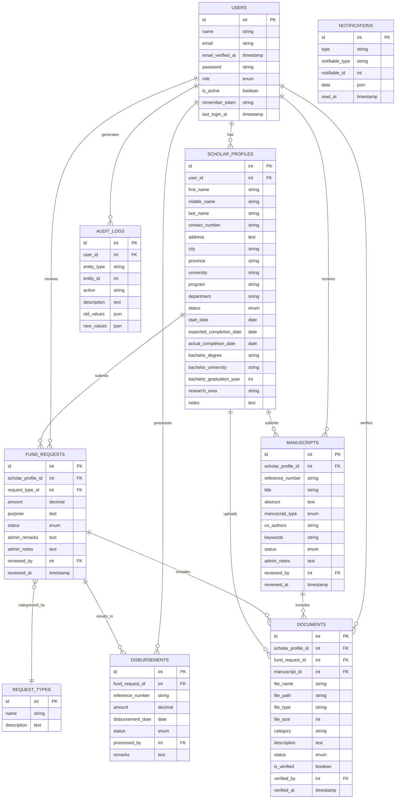

# CLSU-ERDT Scholar Management System - Entity-Relationship Diagram

The ERD above illustrates the database structure for the CLSU-ERDT Scholar Management System, showing the key entities and their relationships:

## Key Entities:

1. **Users**: Base authentication table with role-based access (admin/scholar)
2. **Scholar Profiles**: Detailed information about scholars linked to user accounts
3. **Fund Requests**: Scholar-submitted requests for financial support
4. **Request Types**: Categories of fund requests
5. **Disbursements**: Financial transactions related to approved fund requests
6. **Manuscripts**: Research documents submitted by scholars
7. **Documents**: Uploaded files associated with profiles, requests, or manuscripts
8. **Audit Logs**: System-wide activity tracking
9. **Notifications**: System notifications for users

## Key Relationships:

- Each User can have one Scholar Profile (for scholars)
- Scholar Profiles can submit multiple Fund Requests and Manuscripts
- Fund Requests are categorized by Request Types
- Approved Fund Requests result in Disbursements
- Documents can be linked to Scholar Profiles, Fund Requests, or Manuscripts
- Users (admins) review Fund Requests, Manuscripts, and verify Documents
- Users (admins) process Disbursements
- All significant actions are recorded in Audit Logs 
