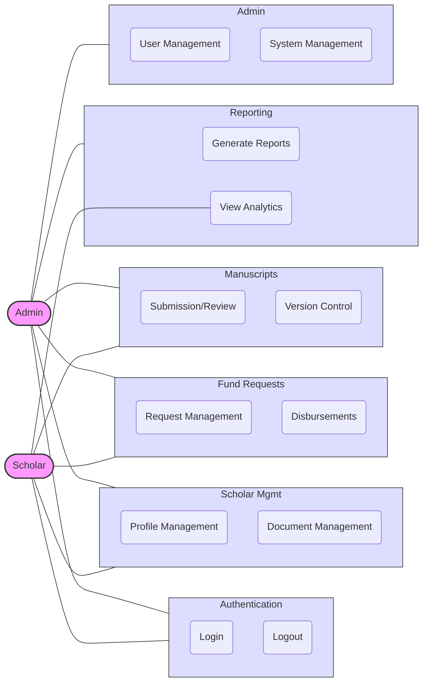

# CLSU-ERDT Scholar Management System - Simplified Use Case Diagram

This simplified Use Case Diagram provides a more compact visualization of the CLSU-ERDT Scholar Management System, focusing on the main module interactions rather than individual use cases.

## Actors

1. **Admin**: ERDT staff members responsible for system management and oversight
2. **Scholar**: Academic funding recipients using the system

## System Modules

### Authentication
Basic user authentication functions (login, logout, etc.)

### Scholar Management
- Profile Management: Create, view and edit scholar profiles
- Document Management: Upload, verify and track academic documents

### Fund Requests
- Request Management: Create, review, and approve/reject funding requests
- Disbursements: Process and track fund disbursements

### Manuscripts
- Submission/Review: Submit and review academic manuscripts
- Version Control: Track and manage manuscript versions

### Reporting
- Generate Reports: Create various system reports
- View Analytics: Access system dashboards and analytics

### Admin
- User Management: Manage accounts and permissions
- System Management: Configure settings, view logs, backup data

## Key Interactions

- **Administrators** have access to all system modules
- **Scholars** can access Authentication, Scholar Management, Fund Requests, Manuscripts, and Analytics
- Access to specific features within each module is determined by user role

This simplified diagram provides a clearer high-level overview of the system's functionality while being more readable when rendered. 
