```mermaid
flowchart LR
    %% Stickman Actors
    Admin(("👨‍💼")):::stickman
    Scholar(("👨‍🎓")):::stickman
    
    %% Labels for stickmen
    AdminLabel["Administrator"]:::actorLabel
    ScholarLabel["Scholar"]:::actorLabel
    
    %% Connect labels to stickmen
    Admin --- AdminLabel
    Scholar --- ScholarLabel
    
    %% Main Module Groups with icons and better styling
    subgraph Auth["🔐 Authentication"]
        direction TB
        Login("🔑 Login"):::action
        Logout("🚪 Logout"):::action
    end
    
    subgraph SM["👨‍🎓 Scholar Mgmt"]
        direction TB
        Profile("👤 Profile Management"):::action
        Docs("📄 Document Management"):::action
    end
    
    subgraph FR["💰 Fund Requests"]
        direction TB
        Request("📝 Request Management"):::action
        Disburse("💸 Disbursements"):::action
    end
    
    subgraph MS["📚 Manuscripts"]
        direction TB
        Submit("📤 Submission/Review"):::action
        Version("🔄 Version Control"):::action
    end
    
    subgraph Rep["📊 Reporting"]
        direction TB
        Reports("📋 Generate Reports"):::action
        Analytics("📈 View Analytics"):::action
    end
    
    subgraph Adm["⚙️ Admin"]
        direction TB
        Users("👥 User Management"):::action
        System("🖥️ System Management"):::action
    end
    
    %% Connections from Admin to modules
    Admin -.-> Auth
    Admin -.-> SM
    Admin -.-> FR
    Admin -.-> MS
    Admin -.-> Rep
    Admin -.-> Adm
    
    %% Connections from Scholar to modules
    Scholar -.-> Auth
    Scholar -.-> SM
    Scholar -.-> FR
    Scholar -.-> MS
    Scholar -.-> Analytics
    
    %% Custom styling
    classDef stickman stroke-width:2px,stroke:#333,fill:#fff,color:#333,font-size:24px;
    classDef actorLabel fill:none,stroke:none,color:#333,font-weight:bold;
    classDef module fill:#e2f0fb,stroke:#0d6efd,stroke-width:1px,color:#0d6efd,font-weight:bold,border-radius:5px;
    classDef action fill:#ffffff,stroke:#6c757d,stroke-width:1px,color:#212529,border-radius:5px;
    
    class Auth,SM,FR,MS,Rep,Adm module;
```

# CLSU-ERDT Scholar Management System - Use Case Diagram

This Use Case Diagram uses stickman figures to represent the system actors, providing a more standard UML-style representation while maintaining visual clarity.

## Diagram Elements

### Actors
- **Administrator**: ERDT staff members who manage the system
- **Scholar**: Students and researchers who are recipients of ERDT funding

### System Modules

#### 🔐 Authentication
Core user authentication features providing secure access to the system.

#### 👨‍🎓 Scholar Management
Tools for maintaining scholar information and documents:
- Profile creation and maintenance
- Academic document uploads and verification

#### 💰 Fund Requests
Financial management features:
- Funding request submission and approval workflow
- Disbursement processing and tracking

#### 📚 Manuscripts
Research document management:
- Manuscript submission and review process
- Version tracking and control

#### 📊 Reporting
Data analysis and reporting tools:
- Standard and custom report generation
- Analytics dashboards and visualizations

#### ⚙️ Administration
System configuration and maintenance:
- User account management
- System settings and data management

## Actor Interactions

- **Administrators** have complete access to all system modules
- **Scholars** can access their personal information, submit requests and manuscripts, and view analytics relevant to their status

This representation follows more traditional UML use case diagramming conventions with stickman figures while maintaining a modern, readable design. 
