```mermaid
flowchart LR
    %% Actors with custom styling
    Admin([👤 Admin]):::actor
    Scholar([👨‍🎓 Scholar]):::actor
    
    %% Main Module Groups with icons and better styling
    subgraph Auth["🔐 Authentication"]
        direction TB
        Login("🔑 Login"):::action
        Logout("🚪 Logout"):::action
    end
    
    subgraph SM["👨‍🎓 Scholar Mgmt"]
        direction TB
        Profile("👤 Profile Management"):::action
        Docs("📄 Document Management"):::action
    end
    
    subgraph FR["💰 Fund Requests"]
        direction TB
        Request("📝 Request Management"):::action
        Disburse("💸 Disbursements"):::action
    end
    
    subgraph MS["📚 Manuscripts"]
        direction TB
        Submit("📤 Submission/Review"):::action
        Version("🔄 Version Control"):::action
    end
    
    subgraph Rep["📊 Reporting"]
        direction TB
        Reports("📋 Generate Reports"):::action
        Analytics("📈 View Analytics"):::action
    end
    
    subgraph Adm["⚙️ Admin"]
        direction TB
        Users("👥 User Management"):::action
        System("🖥️ System Management"):::action
    end
    
    %% Connections from Admin to modules with curved lines
    Admin -.-> Auth
    Admin -.-> SM
    Admin -.-> FR
    Admin -.-> MS
    Admin -.-> Rep
    Admin -.-> Adm
    
    %% Connections from Scholar to modules with curved lines
    Scholar -.-> Auth
    Scholar -.-> SM
    Scholar -.-> FR
    Scholar -.-> MS
    Scholar -.-> Analytics
    
    %% Improved styling
    classDef actor fill:#f8d7da,stroke:#dc3545,stroke-width:2px,color:#212529,font-weight:bold,border-radius:10px;
    classDef module fill:#e2f0fb,stroke:#0d6efd,stroke-width:1px,color:#0d6efd,font-weight:bold,border-radius:5px;
    classDef action fill:#ffffff,stroke:#6c757d,stroke-width:1px,color:#212529,border-radius:5px;
    
    class Auth,SM,FR,MS,Rep,Adm module;
```

# CLSU-ERDT Scholar Management System - Use Case Diagram

This enhanced Use Case Diagram provides an attractive visualization of the CLSU-ERDT Scholar Management System's main modules and actor interactions.

## Diagram Elements

### Actors
- **👤 Admin**: System administrators who manage all aspects of the scholar management system
- **👨‍🎓 Scholar**: Students and researchers who are recipients of ERDT funding

### System Modules

#### 🔐 Authentication
Core user authentication features that provide secure access to the system.

#### 👨‍🎓 Scholar Management
Tools for maintaining scholar information and documents:
- Profile creation and maintenance
- Academic document uploads and verification

#### 💰 Fund Requests
Financial management features:
- Funding request submission and approval workflow
- Disbursement processing and tracking

#### 📚 Manuscripts
Research document management:
- Manuscript submission and review process
- Version tracking and control

#### 📊 Reporting
Data analysis and reporting tools:
- Standard and custom report generation
- Analytics dashboards and visualizations

#### ⚙️ Administration
System configuration and maintenance:
- User account management
- System settings and data management

## System Access

- **Administrators** have complete access to all system modules
- **Scholars** can access their personal information, submit requests and manuscripts, and view analytics relevant to their status

This diagram illustrates the core functionality of the CLSU-ERDT Scholar Management System in an easy-to-understand visual format. 
