```mermaid
flowchart LR
    %% Actors
    Admin([Administrator]):::actor
    Scholar([Scholar]):::actor
    
    %% Authentication Module
    subgraph Authentication
        direction TB
        Login(Login)
        Logout(Logout)
        ResetPwd(Reset Password)
        VerifyEmail(Verify Email)
        CreateUserAccount(Create User Account)
    end
    
    %% Scholar Management Module
    subgraph ScholarManagement["Scholar Management"]
        direction TB
        ViewScholars(View Scholars)
        AddScholar(Add Scholar)
        EditProfile(Edit Scholar Profile)
        ViewDetails(View Scholar Details)
        UpdateStatus(Update Scholar Status)
        UploadDocs(Upload Documents)
        VerifyDocs(Verify Documents)
        TrackProgress(Track Academic Progress)
    end
    
    %% Fund Request Module
    subgraph FundRequest["Fund Request Management"]
        direction TB
        SubmitRequest(Submit Fund Request)
        ReviewRequest(Review Fund Request)
        ApproveRequest(Approve/Reject Request)
        ProcessDisburse(Process Disbursement)
        TrackDisburse(Track Disbursement Status)
        GenDisburseReport(Generate Disbursement Report)
        ManageRequestTypes(Manage Request Types)
    end
    
    %% Manuscript Module
    subgraph Manuscript["Manuscript Management"]
        direction TB
        SubmitManuscript(Submit Manuscript)
        ReviewManuscript(Review Manuscript)
        TrackVersion(Track Manuscript Version)
        AddComments(Add Comments)
        ApproveManuscript(Approve/Reject Manuscript)
        GenManuscriptReport(Generate Manuscript Report)
    end
    
    %% Reporting Module
    subgraph Reporting
        direction TB
        GenScholarReport(Generate Scholar Status Report)
        GenFundReport(Generate Fund Utilization Report)
        ExportData(Export Data to Excel)
        ViewDashboard(View Analytics Dashboard)
    end
    
    %% System Administration
    subgraph Administration["System Administration"]
        direction TB
        ManageUsers(Manage User Accounts)
        ViewLogs(View Audit Logs)
        ConfigSettings(Configure System Settings)
        BackupData(Backup/Restore Data)
    end
    
    %% Connections from Admin to use cases
    Admin --- Login
    Admin --- Logout
    Admin --- ViewScholars
    Admin --- AddScholar
    Admin --- EditProfile
    Admin --- ViewDetails
    Admin --- UpdateStatus
    Admin --- VerifyDocs
    Admin --- TrackProgress
    Admin --- ReviewRequest
    Admin --- ApproveRequest
    Admin --- ProcessDisburse
    Admin --- TrackDisburse
    Admin --- GenDisburseReport
    Admin --- ManageRequestTypes
    Admin --- ReviewManuscript
    Admin --- TrackVersion
    Admin --- AddComments
    Admin --- ApproveManuscript
    Admin --- GenManuscriptReport
    Admin --- GenScholarReport
    Admin --- GenFundReport
    Admin --- ExportData
    Admin --- ViewDashboard
    Admin --- ManageUsers
    Admin --- ViewLogs
    Admin --- ConfigSettings
    Admin --- BackupData
    Admin --- CreateUserAccount
    
    %% Connections from Scholar to use cases
    Scholar --- Login
    Scholar --- Logout
    Scholar --- ResetPwd
    Scholar --- VerifyEmail
    Scholar --- EditProfile
    Scholar --- ViewDetails
    Scholar --- UploadDocs
    Scholar --- TrackProgress
    Scholar --- SubmitRequest
    Scholar --- TrackDisburse
    Scholar --- SubmitManuscript
    Scholar --- TrackVersion
    Scholar --- AddComments
    Scholar --- ViewDashboard
    
    %% Styling
    classDef actor fill:#f9f,stroke:#333,stroke-width:2px;
    classDef module fill:#ddf,stroke:#333,stroke-width:1px;
    
    class Authentication,ScholarManagement,FundRequest,Manuscript,Reporting,Administration module;
```

# CLSU-ERDT Scholar Management System - Use Case Diagram

This improved Use Case Diagram provides a clearer visualization of the CLSU-ERDT Scholar Management System's functionalities and how users interact with them.

## Actors

1. **Administrator**: ERDT staff members responsible for system management, request processing, and scholar oversight.
2. **Scholar**: Academic funding recipients who use the system to manage their profiles and academic requirements.

## System Modules

### Authentication
Basic user authentication functions including login, logout, password reset, and email verification. User accounts are created exclusively by administrators.

### Scholar Management
Functions for managing scholar profiles, documents, and academic progress tracking.

### Fund Request Management
Complete workflow for funding requests from submission to disbursement.

### Manuscript Management
Features for manuscript submission, review, version tracking, and approval.

### Reporting
Generation of various reports and analytics dashboards.

### System Administration
System maintenance functions including user management, audit logs, and data backup.

## Key Interactions

- **Administrators** have access to all system modules with full management capabilities, including creating user accounts
- **Scholars** primarily interact with their own profile information, fund requests, manuscripts, and personal dashboard
- Both actors share common authentication features (except user creation, which is admin-only)

This diagram helps visualize the scope of functionality and user interactions within the system. 
